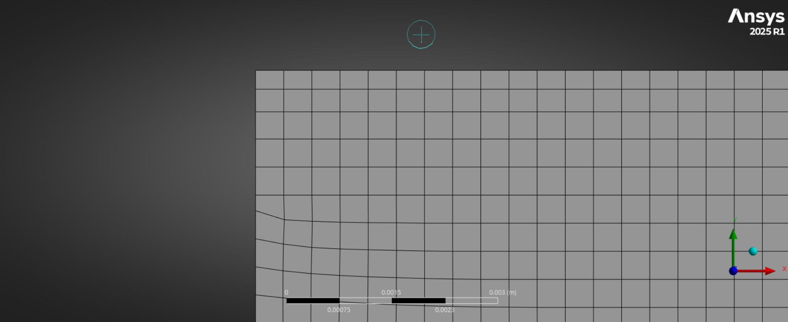
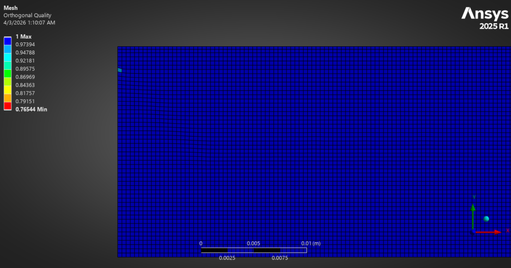
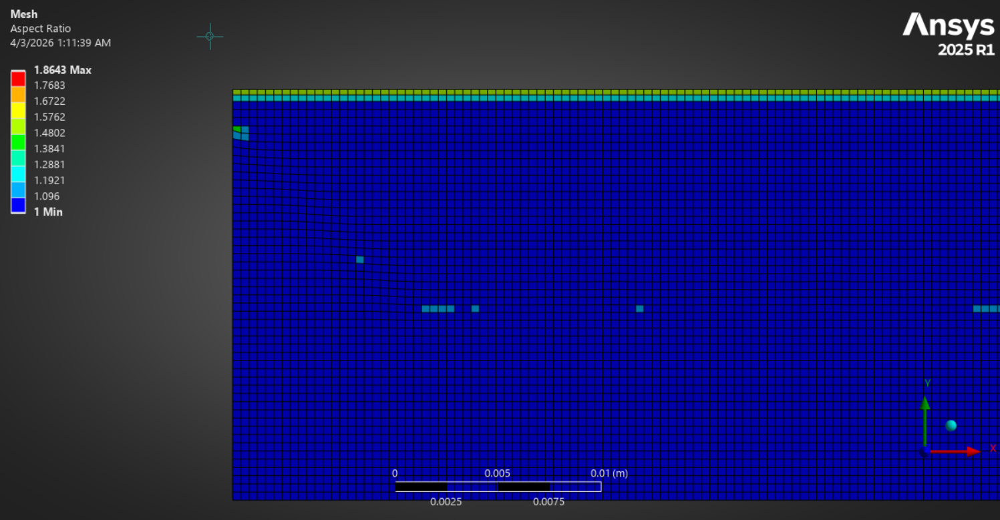

# Case 1: Laminar Pipe Flow Verification (ANSYS Fluent)

## 1. Project Objective
To validate the accuracy of the ANSYS Fluent solver against the analytical Hagen-Poiseuille equations for internal laminar flow.

## 2. Analytical Design (The Physics)
Before simulating, the domain was designed using the following parameters to ensure a fully developed profile:

### A. Reynolds Number (Re)
$$Re = \frac{\rho v D}{\mu}$$
* **Density ($\rho$):** 1000 kg/m³
* **Velocity ($v$):** 0.005 m/s
* **Diameter ($D$):** 0.02 m (20mm)
* **Viscosity ($\mu$):** 0.001 Pa·s
* **Result:** $Re = 100$ (Confirmed Laminar)

### B. Hydrodynamic Entrance Length ($L_h$)
The distance required for the flow to become "Fully Developed" is calculated as:

$$L_h \approx 0.06 \cdot Re \cdot D$$

**Calculation:**
$$L_h = 0.06 \cdot 100 \cdot 0.02 = 0.12 \text{ m (120 mm)}$$

### C. Engineering Rationale for 500 mm Length
While $L_h$ is only 120 mm, a **500 mm domain** was selected for three reasons:
1. **Validation Stability:** Provides 380 mm of "Stationary Flow" to confirm the parabolic profile remains constant.
2. **Visual Contrast:** Allows for a clear visual "story" in the velocity contours, showing the transformation from a flat inlet to a parabola.
3. **Boundary Interference:** Prevents outlet pressure fluctuations from affecting the measurement zone.

## 3. Mesh Quality & Statistics

| Mesh Detail (Inlet) | Orthogonal Quality | Aspect Ratio |
| :---: | :---: | :---: |
|  |  |  |
| *5 Inflation Layers at Wall* | *Min Quality: 0.78 (Excellent)* | *Max Ratio: 2.6 (Excellent)* |

**Mesh Specifications:**
* **Type:** Structured Hexahedral
* **Inflation Layers:** 5 Layers with 1.2 Growth Rate
* **Total Elements:** 22026
* **Total Nodes:** 21004
